# YouTube Watch History Analysis
**DSA210: Introduction to Data Science Course Project**  
Sabanci University Fall 2024  

## Project Overview  
This project is part of the **DSA210: Introduction to Data Science** course at Sabanci University. The primary goal is to analyze my personal YouTube watch history to uncover insights about my viewing patterns, habits, and interests. Using data collected via Google Takeout, I performed exploratory data analysis to identify trends in my behavior and understand how external factors might influence my choices.  

---

## Table of Contents  
- [Motivation](#motivation)  
- [Data Source](#data-source)  
- [Data Analysis Techniques](#data-analysis-techniques)  
- [Visualizations](#visualizations)  
- [Findings](#findings)  
- [Limitations and Future Work](#limitations-and-future-work)  

---

## Motivation  
I wanted to explore my interaction with YouTube, one of the platforms I use frequently, and gain deeper insights into my viewing preferences and habits. By analyzing my watch history, I aimed to answer specific questions about my interests, time based patterns, and how my viewing habits evolve under different circumstances, such as during an academic semester.

---

## Data Source  
The data was obtained from my YouTube account through [**Google Takeout**](https://takeout.google.com/), which provides the YouTube watch history in an HTML format. Additional video details were fetched using the **YouTube API**, including metadata such as video duration, category, and tags. The dataset includes records from **July to December 2024** and consists of the following fields:  
- `videoURL`, `title`, `channelName`, `timeWatched`, `tags`, `duration`, `categoryName`, `publishedAt`, `defaultAudioLanguage`, `viewCount` and more.  

The final dataset was structured as a pandas DataFrame after preprocessing.  

---

## Data Analysis Techniques  
### Data Processing (Data_Extraction.ipynb)
- HTML file was parsed using BeautifulSoup and loaded into a Pandas DataFrame.
- Videos were filtered to include only those watched between July and December.
- Advertisement videos were removed from the dataset.
- Metadata (e.g., `tags`, `categoryName`, `duration`, `viewCount`) was fetched using the YouTube API and merged with the dataset.
- Columns like `tags` and `duration` were preprocessed for easier analysis.

For details, see the [Data_Extraction.ipynb](Data_Extraction.ipynb) notebook.

### Data Analysis and Visualizations
The [analysis](Data_Analysis.ipynb) was conducted using Python libraries such as pandas, seaborn, matplotlib, and plotly. Specific techniques included:  
- **Exploratory Data Analysis**: Identified trends in viewing times, days, and content categories.  
- **Statistical Tests**: Conducted statistical tests to evaluate hypotheses, such as differences in video durations on weekends vs. weekdays.
- **Summary Statistics**: Calculated key metrics such as average video duration, maximum video duration, average videos watched per day, and more.

For details, see the [Data_Analysis.ipynb](Data_Analysis.ipynb) notebook.

---

## Visualizations
1. **Total number of videos watched by day of week & time of day**
   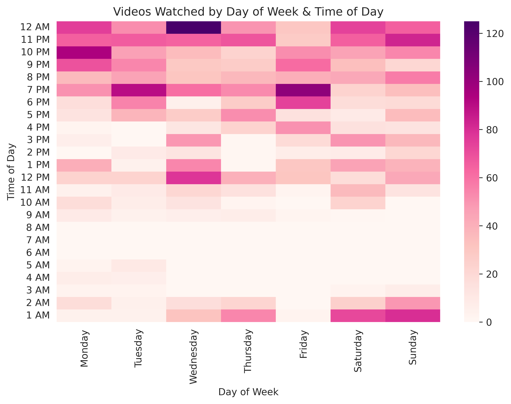
2. **Most-watched 5 channels by the number of videos**
   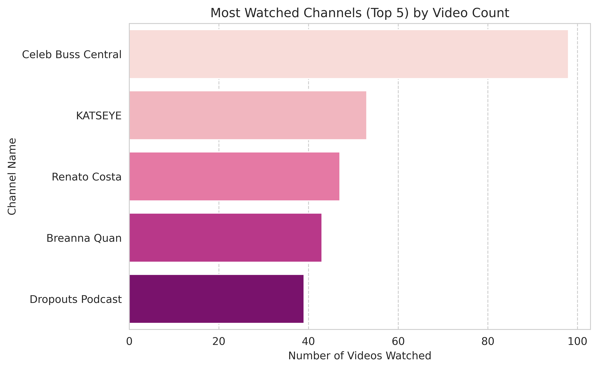
3. **Total videos watched by the day of the week**
   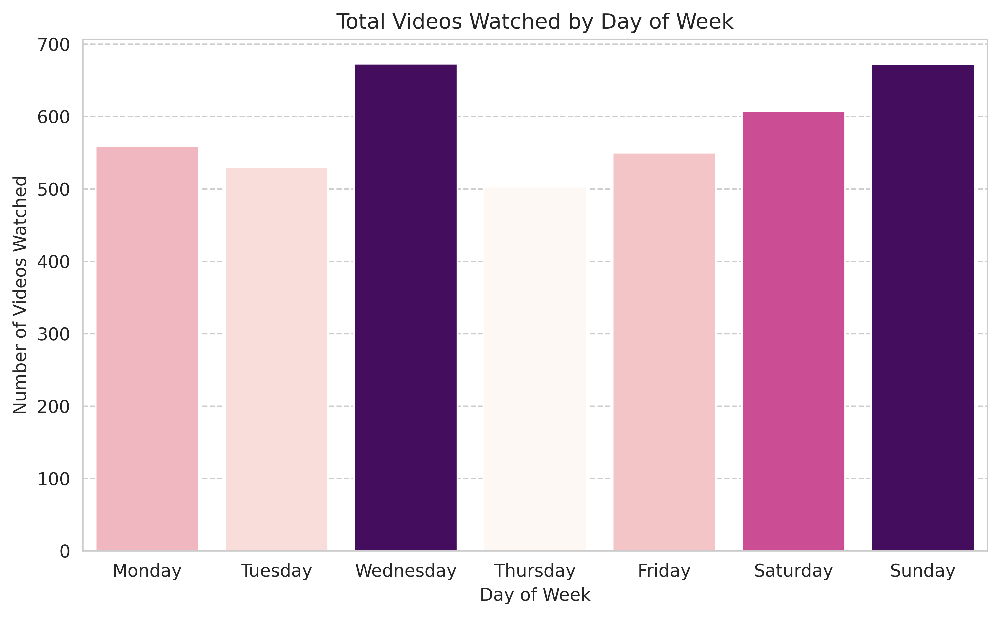
4. **Distribution of the age of videos (time since publication) at the time they were watched**
   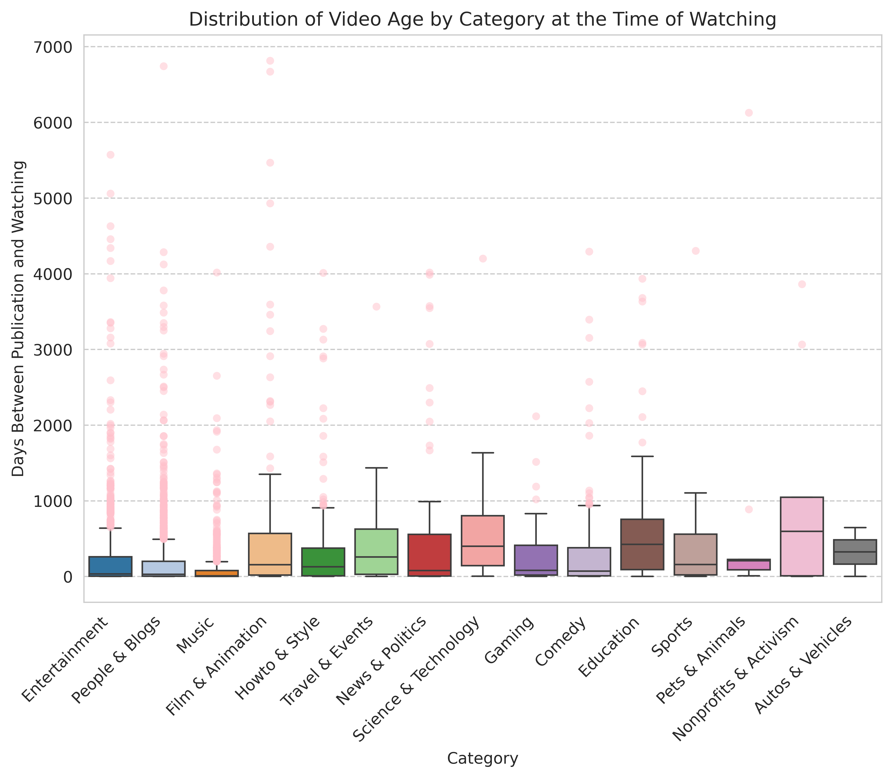
5. **Distribution of the number of videos watched across categories throughout the day**
   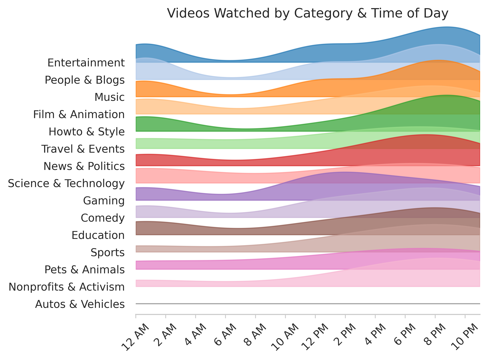
6. **Watch frequency over the hours of the day**  
   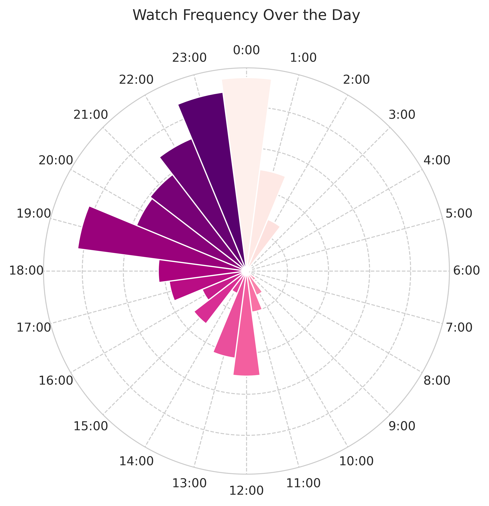
7. **Distribution of top 10 tags across day segments (morning vs. night)**  
   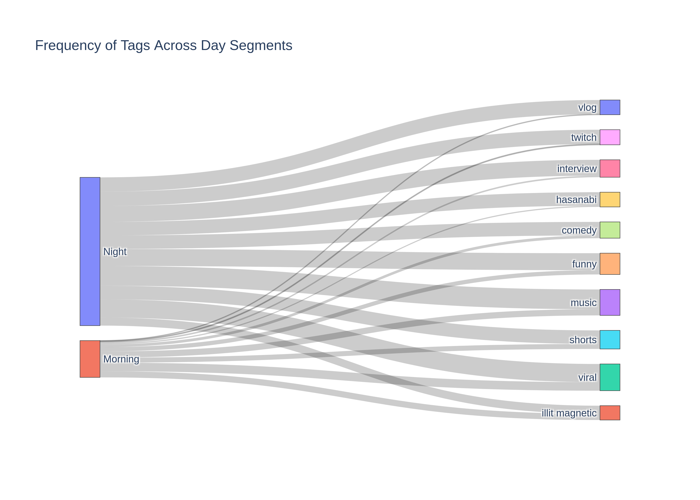  
8. **Proportion of "Education" videos before and during the academic semester**
   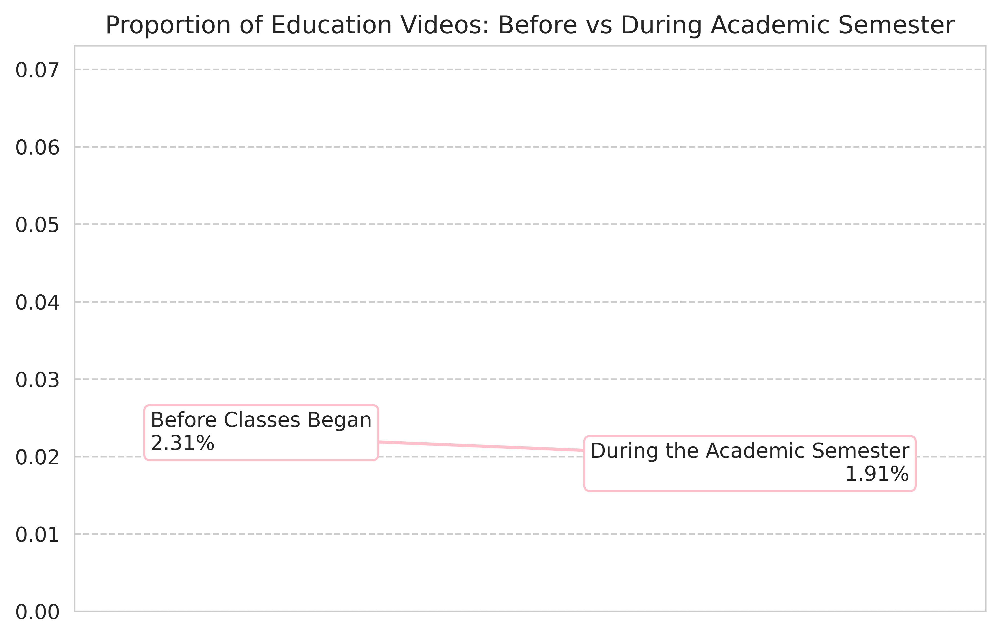  
9. **Frequently occurring words in video titles**  
   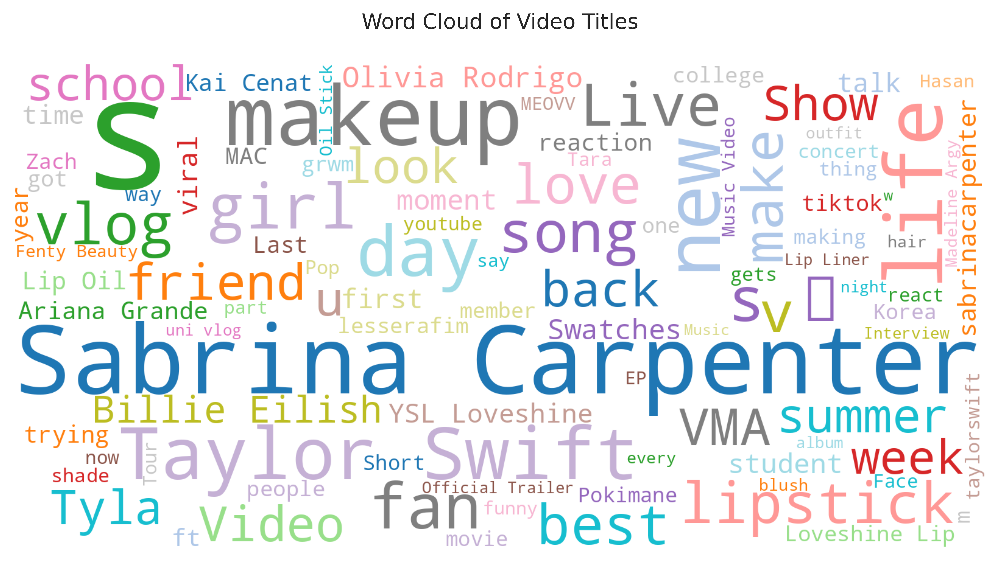  
10. **Total number of videos watched per month by category**  
   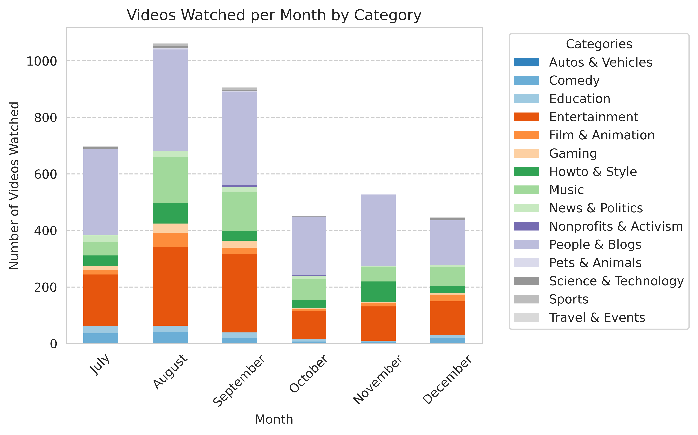  
11. **Video duration vs. view count** 
   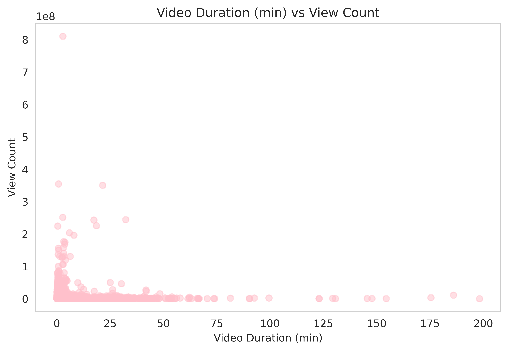  
12. **Video duration on weekdays vs. weekends**  
   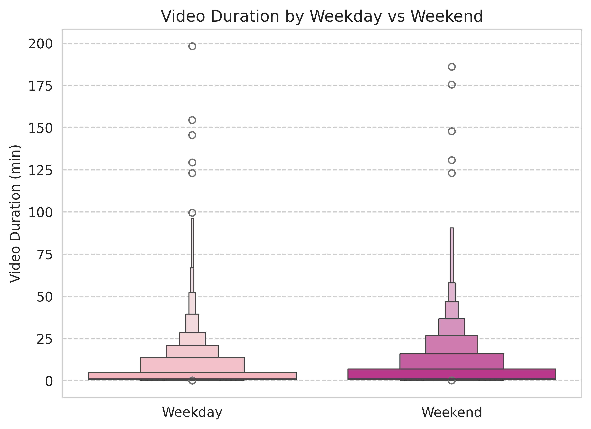  
13. **Percentage of videos watched by category**  
   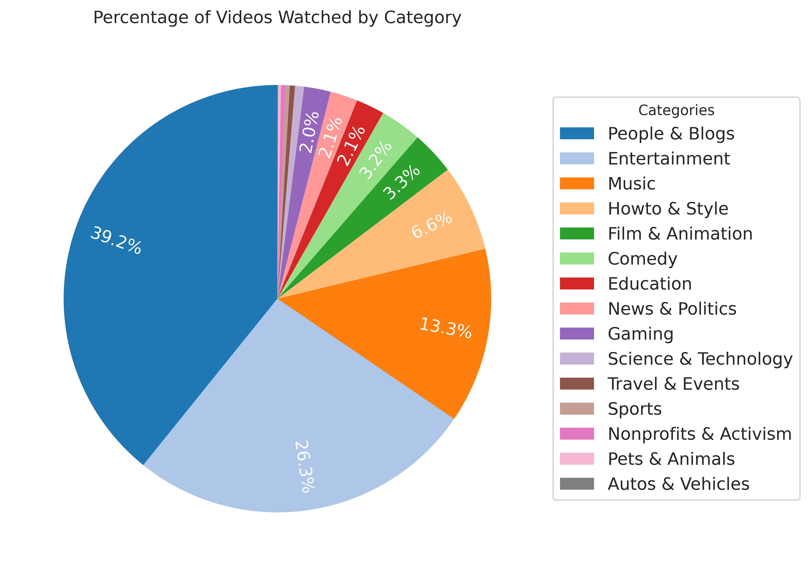  
 
---

## Findings  
### Time Based Patterns  
- **Daily Routines**: The [polar chart](#polarchart) shows that most of my viewing activity occurs during the late evening and night, with the peak hours being between 8 PM and 12 AM.
This indicates a strong preference for consuming content during leisure hours, potentially reflecting habits aligned with relaxation or free time after daily responsibilities.
The ridgeline plot reveals that categories such as "Entertainment" and "Music" dominate during the late evening and nighttime hours, aligning with typical leisure time. In contrast, educational videos exhibit relatively consistent viewing throughout the day, with slight peaks in the afternoon and evening, potentially reflecting study sessions.
- **Weekend vs. Weekday**: A two-sample t-test was conducted to determine whether there was a significant difference in the duration of videos watched between weekends and weekdays. The null hypothesis (H₀: No difference in video durations between weekends and weekdays) was rejected. This indicates that there is a statistically significant difference in the durations of videos watched on weekends compared to weekdays. The boxen plot illustrates that the median video duration on weekends is slightly higher than on weekdays. This trend may suggest that weekends allow for more leisure time to consume longer content.
- **Weekly Trends**: The bar chart showcasing videos watched by the day of the week revealed that Wednesday and Sunday had the highest viewing activity, with Thursday showing a slight dip.
- **Monthly Trends**: Video consumption peaked significantly in August, while the proportions of categories remained consistent across the months.

### Content Preferences  
- **Categories**: Analysis of categories demonstrated that "People & Blogs" dominated the viewership (39%), followed by "Entertainment" (26%), reflecting a strong preference for casual and engaging content.  
- **Tags**: A chi-squared test was conducted to evaluate whether the distribution of tags differed significantly between videos watched in the morning (6 AM – 12 PM) and at night (8 PM – 2 AM). The null hypothesis (H₀: Tag distributions are the same for morning and night) was **not** rejected, which indicates that no statistically significant difference was found in the distribution of tags between the morning and night segments. Popular tags included "vlog", "comedy", and "music".
- **Channels**: The top 5 most-watched channels were led by "Celeb Buss Central", which significantly outpaced others, indicating a strong interest in celebrity-related content.
- **Titles**: The word cloud of video titles revealed key interests in music, beauty, and lifestyle topics. Prominent mentions of "Sabrina Carpenter", "Taylor Swift", and "Billie Eilish" highlight a strong interest in pop culture and specific artists. Words like "makeup", "lipstick" and "look" reflect a focus on beauty-related content.

### Behavioral Insights  
- **Academic Influence**: It was expected that the proportion of "Education" videos would increase during the academic semester as my focus shifted toward academic content. Contrary to expectations, the proportion of "Education" videos slightly decreased during the semester. This may indicate a shift in my watching habits toward non-academic or recreational content during the semester, perhaps as a way to balance academic responsibilities with leisure.
- **Viewing Preferences and Patterns**: The heatmap revealed consistent engagement across weekdays and weekends, but with broader time windows on weekends, indicating relaxed viewing habits.
The average video duration was 5.72 minutes, reflecting a strong preference for shorter, easily consumable content.
The Pearson correlation between view count and video duration was calculated to be -0.027, indicating a negligible negative relationship. This suggests that video popularity is not a significant factor in determining my preference for the length of the videos I watch.
Out of the 4094 videos watched, 3940 were unique, averaging 22.25 videos per day. This highlights a tendency toward exploring diverse content rather than rewatching the same videos.
- **Category Specific Viewing Trends**: The majority of the videos watched are relatively recent, as indicated by the concentration of lower medians across most categories in the box plot. However, certain categories, such as "Nonprofits & Activism" and "Education", show a significant proportion of older videos, with their median and interquartile ranges being notably higher than other categories suggesting enduring relevance or niche content consumption. Categories like "Entertainment", "People & Blogs", and "Music" had the lowest video age, reflecting a preference for fresh and trending content in these areas.

---

## Limitations and Future Work  
### Limitations  
- **Data Range**: The dataset spans only six months, limiting insights into long-term patterns.  
- **Granularity**: YouTube does not provide data on how much of each video was watched, and it also does not provide a way to differentiate between regular videos and YouTube Shorts.  

### Future Work  
- **Yearly Trends**: Collect data over a full year for comprehensive insights.  
- **Advanced Analytics**: Incorporate machine learning for content recommendation analysis.

---

This analysis offered valuable insights into my YouTube habits and preferences. For further details, please explore the scripts and visualizations in this repository.  
